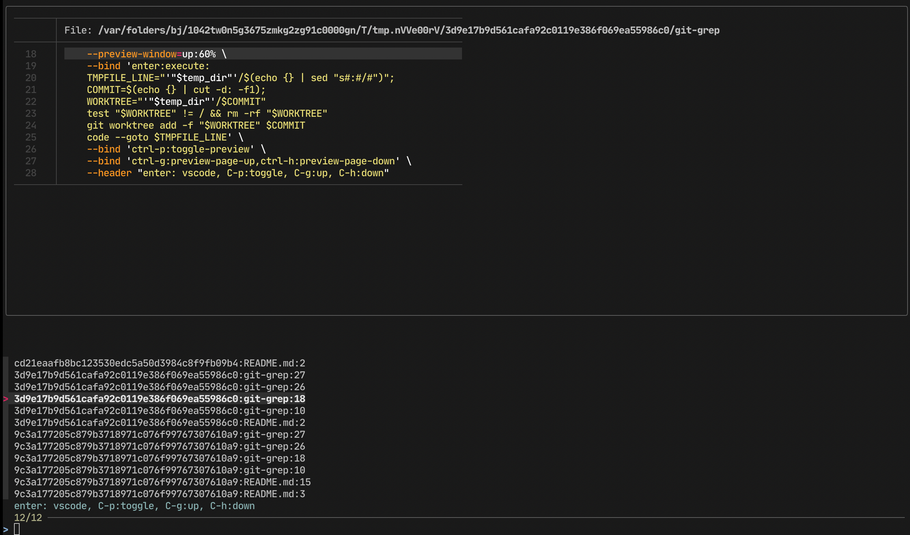

# git-grep-vscode

Grep through all git commits easily with fzf, preview, and vscode

# Requirements

- git
- fzf
- bat
- vscode (code from the console)

# Features

- Search through the whole git history
- Fast and straightforward preview with the bat
- Simple investigation with vscode. Each view action creates a temporary directory with commit content. VSCode open exact document at the highlighed line.

# Screenshot

That's how it looks for `git-grep preview` for this repository.

On every `enter` button push it will open vscode with all context. 

